# ComfyUI 桌面管家 · ComfyUI Desk

> Windows 上的一站式 ComfyUI 管理工具：安装部署、启动停止、模型下载、节点维护、工作流运行，全部图形化。


**简体中文** | [**English**](#english)

---

## 简体中文

### 简介

ComfyUI 桌面管家把 ComfyUI 的日常操作从命令行搬进图形界面：装环境、拉源码、配镜像、下模型、管节点、跑工作流都不再需要记命令。内置 GitCode / 清华 PyPI / 阿里云 / HF 镜像等国内加速链路，发布版随包附带便携 Python 与便携 Git，目标机器无需预装任何环境。

### 界面与功能

#### 仪表盘 · 状态与总控

运行状态一览（已停止 / 启动中 / 运行中 / 错误），一键启动、重启、关闭；同时显示 ComfyUI 版本、显卡、驱动、PyTorch 与 CUDA 可用性、安装路径，并可检查更新、切换 Torch / CUDA 版本。未安装时可直接从这里开始安装或选择已有的 ComfyUI 目录。

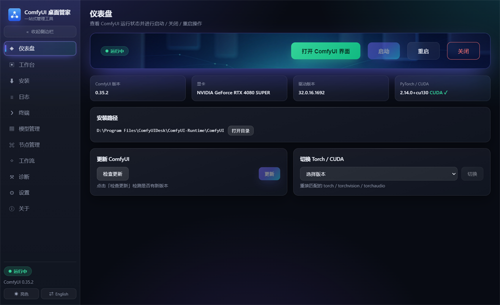

#### 工作台 · ComfyUI 界面直接内嵌

ComfyUI 的网页界面直接内嵌在应用里，无需再打开浏览器；支持刷新、在浏览器打开与全屏。ComfyUI 未运行时可以在本页直接启动。界面提供深色与亮色两套主题，并可与 ComfyUI 自身的主题双向联动。

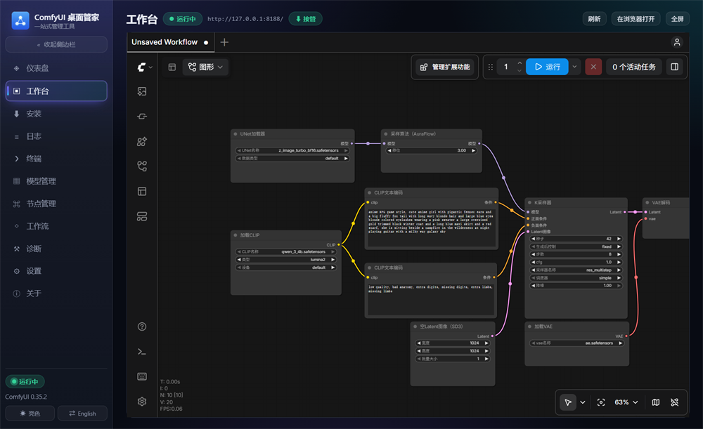

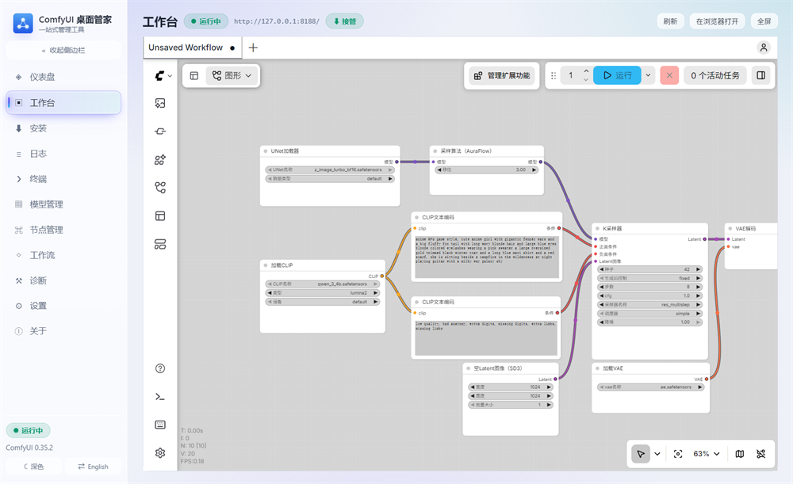

在 ComfyUI 界面里点击缺失模型的「下载」，管家会自动接管链接并按类别存入对应模型目录，随后跳到「模型管理」页显示下载进度。

#### 安装 · 一键部署

选择 Python 解释器、ComfyUI 版本、安装路径与 Torch 变体（自动按显卡推荐，也可指定 CUDA 或 CPU），右侧同时给出硬件检测结果；安装过程有实时进度条与滚动日志。安装的是官方稳定纯净版本，无任何整合包内容。后续规划做个整合包功能，可以联网查询可用整合包配置，在纯净版基础上安装整合包内容，敬请期待。

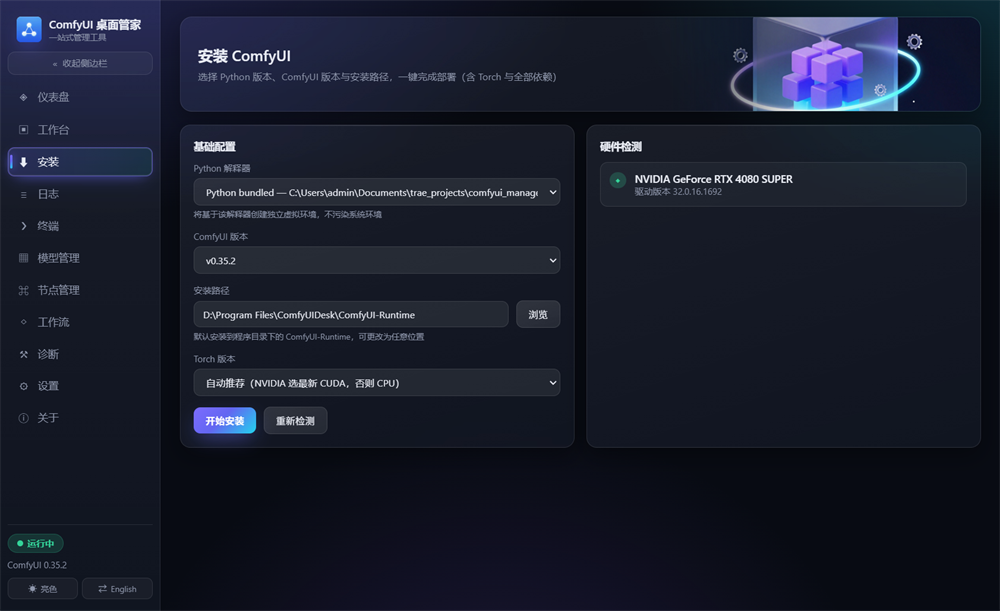

#### 日志 · 统一运行输出

ComfyUI 进程输出与管家自身的安装 / 更新 / 修复 / 节点 / 模型操作全部汇入同一视图，支持关键字过滤、按来源（stdout / stderr / 系统）过滤、自动滚动、复制与清空；日志同时按天落盘保留 7 天，启动失败会自动定位到错误行。

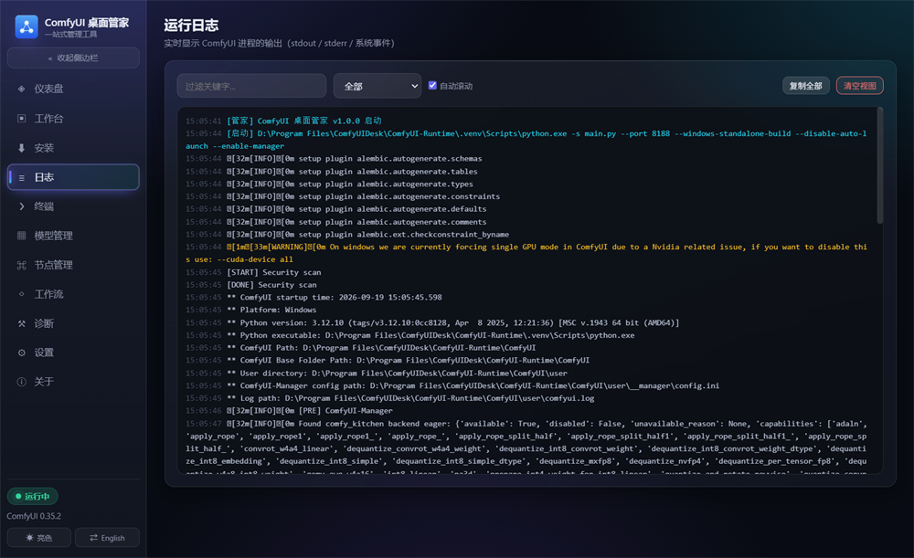

#### 终端 · 真实交互式 Shell

基于 ConPTY 的真实终端，默认使用 Git Bash（`ls`、`grep`、`sed` 等命令开箱可用，缺失时回退 PowerShell），并自动把 ComfyUI 的 venv 与 git 注入 PATH，支持命令历史、Tab 补全与 REPL，可直接在里面跑 Python 与 pip。

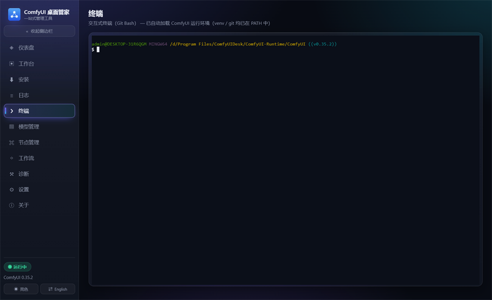

#### 模型管理 · 扫描与下载

按类别扫描本地模型（含子目录），显示大小、日期与完整路径，支持定位与删除；粘贴模型链接即可下载（页面链接自动转直链，ModelScope 同样支持），下载队列带实时进度与速度，可暂停、继续、取消，并支持断点续传——下载中关闭软件，重开后自动接着下。

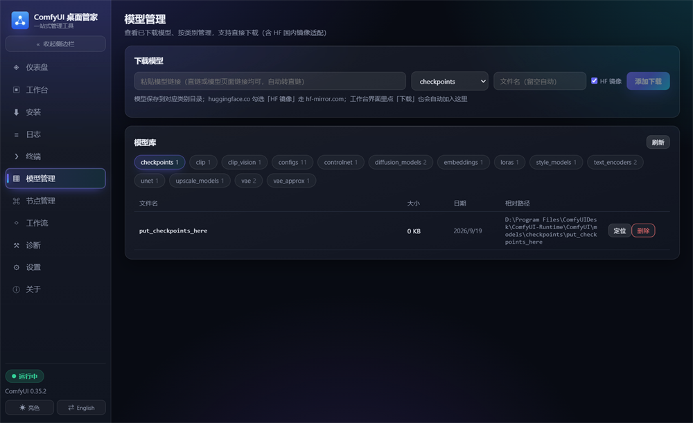

#### 节点管理 · 自定义节点

通过 git 地址安装自定义节点，自动套用设置的 GitHub 代理前缀，安装后自动处理依赖（`requirements.txt` 与 `install.py`）；支持单个更新、批量更新、打开目录与删除。

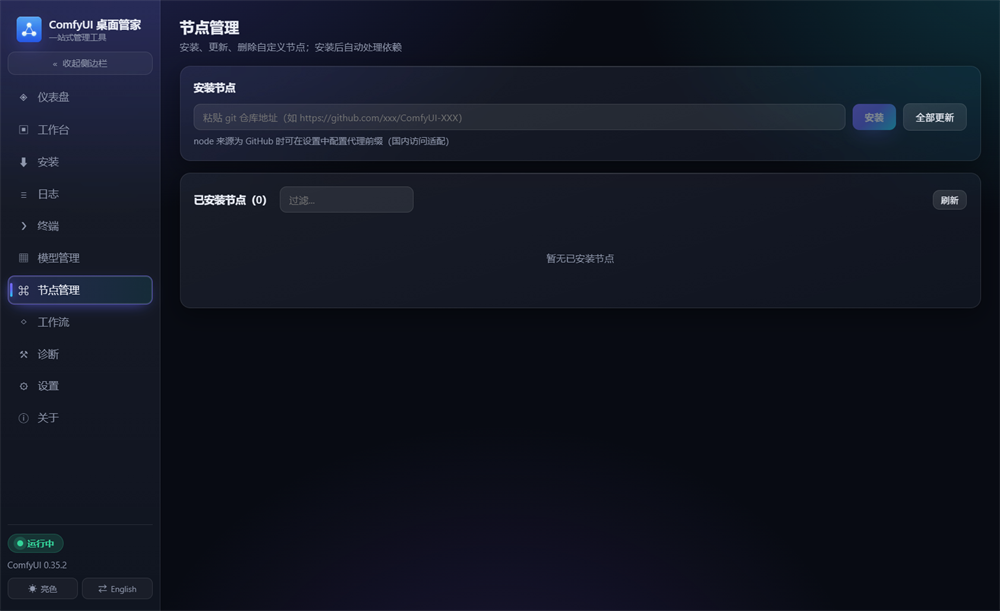

#### 工作流 · 浏览与运行

直接列出工作流目录下的 JSON，识别 API 格式 / 界面格式与节点数量，支持搜索、导入与删除；API 格式的工作流可一键提交到运行中的 ComfyUI 队列。

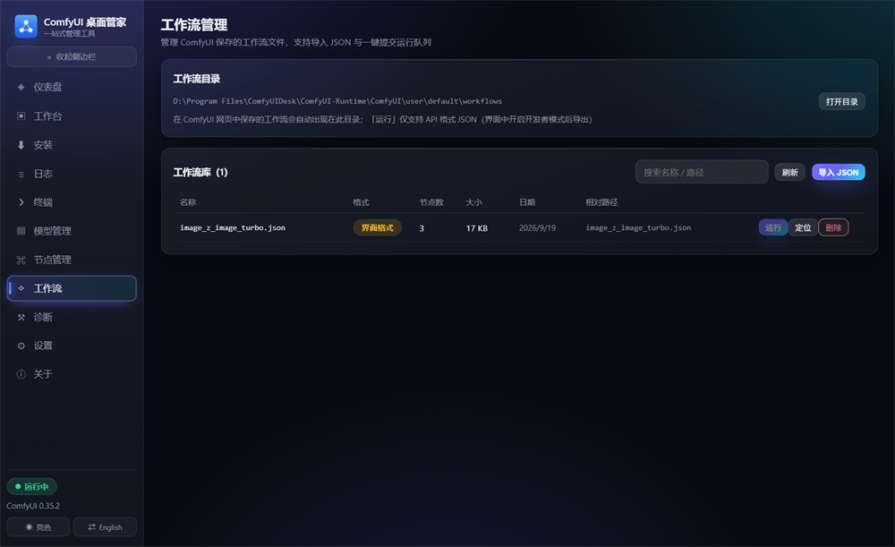

#### 诊断 · 体检与修复

一键体检源码、venv、pip、Torch / CUDA、依赖完整性与 git，并给出修复入口：修复 pip、重装 Torch、重装依赖，或彻底重建整个虚拟环境，过程中显示实时进度。

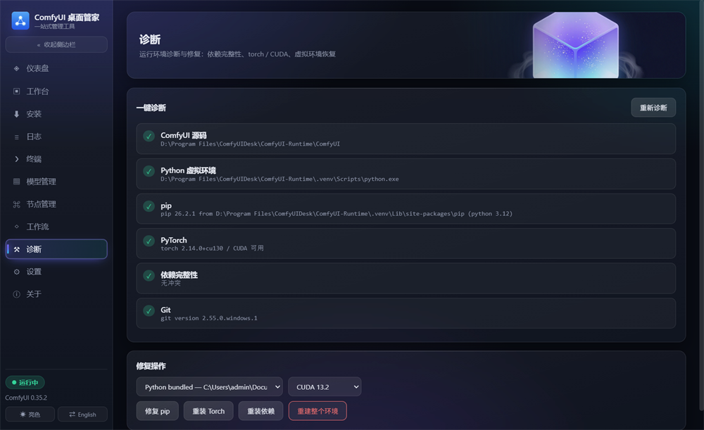

#### 设置 · 外观、参数与镜像

外观与语言（深色 / 亮色、中文 / English，可与 ComfyUI 主题双向联动）、启动参数（端口、额外参数、高级选项表单并实时预览生成的命令行）、源码与镜像（GitCode / GitHub / 自定义仓库、GitHub 代理前缀、pip 与 Torch 下载源）、模型与路径（独立模型目录、安装路径、HF 镜像）、运行环境（Torch 索引、Python 路径）。全部改动自动保存。

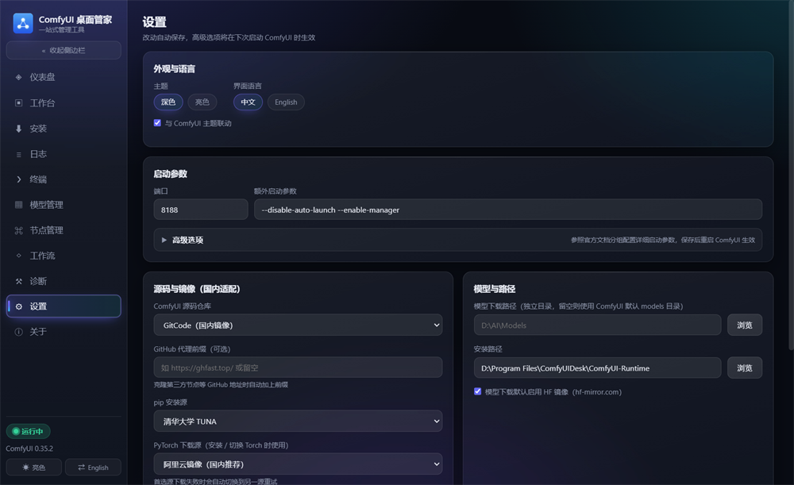

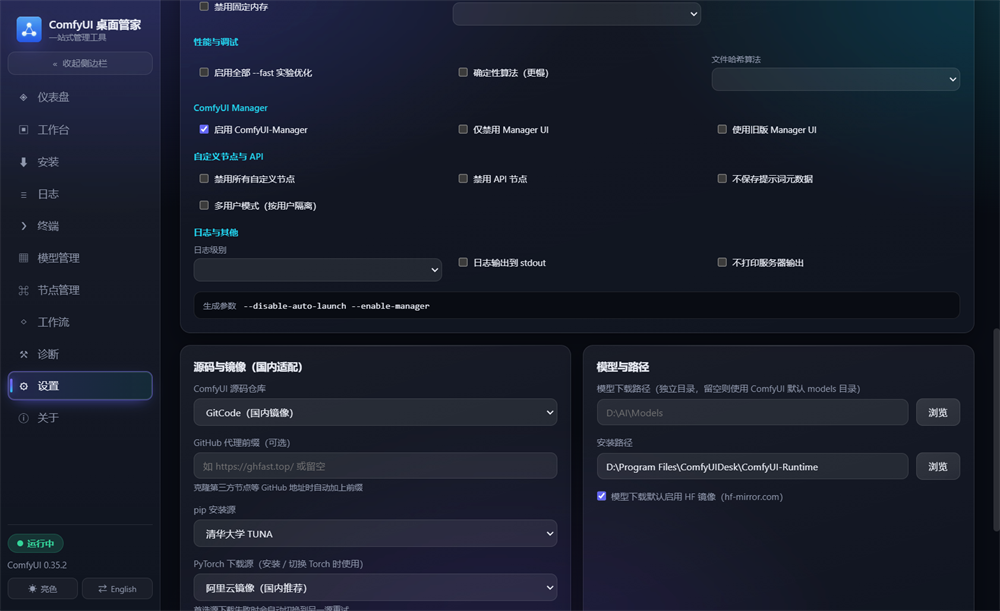

#### 关于 · 运行环境与数据位置

查看版本与运行环境，并可直接定位设置文件、打开用户数据目录与日志目录；「相关链接」里是项目开源地址与 ComfyUI 官方资源。

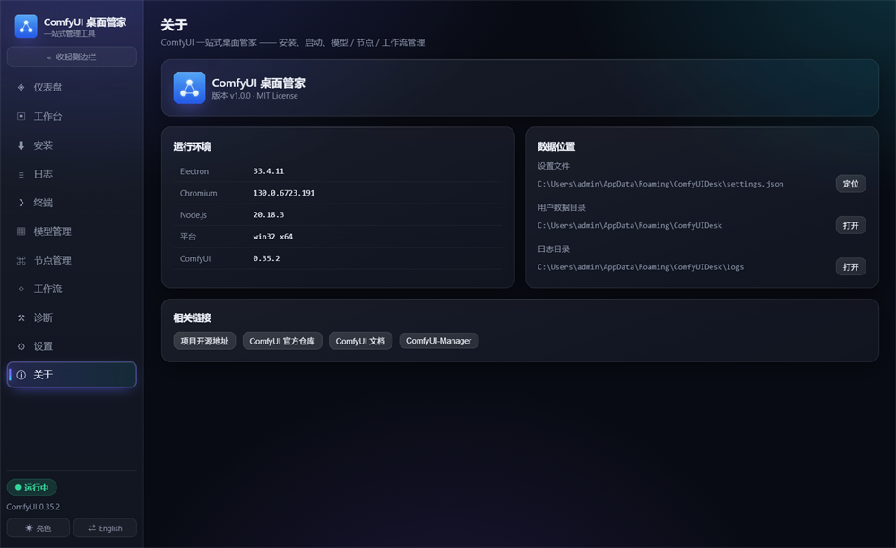

### 快速开始

1. 前往 [Releases](../../releases) 下载最新的 `comfyui-desk-x.y.z-x64.exe`（安装版）或 `comfyui-desk-x.y.z-x64.zip`（绿色版）
2. 打开应用进入「安装」页，选择版本与 Torch 变体，点击「开始安装」
3. 安装完成后回到「仪表盘」点击「启动」，状态变为「运行中」后进入「工作台」即可作画

默认端口 `8188`，可在「设置」中修改。ComfyUI 默认安装在程序目录下的 `ComfyUI-Runtime`（「安装」页可另选位置）。

> **注意**：运行时位于程序目录内，卸载本软件会一并删除（含模型），卸载前请备份重要文件。若把运行时装在程序目录之外，则与本软件互不影响。

### 本地运行

```bash
npm install
npm run dev
```

开发模式下可使用系统已安装的 Python 3.10+；也可运行 `npm run prepare:python` 准备内置便携 Python。

### 开源协议

[MIT](LICENSE)

---

## English

### What it is

ComfyUI Desk moves the everyday ComfyUI chores out of the terminal and into a desktop UI: environment setup, source checkout, mirror configuration, model downloads, custom node maintenance and workflow runs — no commands to memorize. It ships with China-friendly mirrors (GitCode / Tsinghua PyPI / Aliyun / HF mirror) and bundles portable Python and Git, so the target machine needs nothing pre-installed.

### Screens & features

#### Dashboard — status and control

Run status at a glance (stopped / starting / running / error) with one-click start, restart and stop, plus ComfyUI version, GPU, driver, PyTorch and CUDA availability, and install path. Check for updates or switch the Torch / CUDA build from here. When nothing is installed yet, start the installation or point the app at an existing ComfyUI folder.


#### Workbench — the ComfyUI UI, embedded

The ComfyUI web interface is embedded directly in the app, so no browser is needed. Reload it, open it in the system browser, or go full screen; when ComfyUI is not running you can start it right from this page. A dark and a light theme are both available, with two-way syncing to ComfyUI's own theme.


Clicking "download" on a missing model inside the ComfyUI UI hands the link to the manager, which files it into the right model folder and switches to the Models page with live progress.

#### Install — one-click deployment

Pick a Python interpreter, ComfyUI version, install path and Torch variant (recommended automatically for your GPU, or a specific CUDA / CPU build) next to a hardware summary. Installation streams a progress bar and rolling logs.


#### Logs — one stream for everything

ComfyUI process output and every manager operation (install / update / repair / nodes / models) land in the same view, with keyword and source filters (stdout / stderr / system), auto-scroll, copy and clear. Logs are also written to daily files kept for 7 days, and a failed start points you straight at the error line.


#### Terminal — a real interactive shell

A genuine ConPTY terminal, using Git Bash by default (`ls`, `grep`, `sed` and friends work out of the box, PowerShell is the fallback) with the ComfyUI venv and git already on PATH. Command history, tab completion and REPLs all work — run Python or pip right here.


#### Models — library and downloads

Local models are scanned by category (subdirectories included) with size, date and full path, and can be revealed in Explorer or deleted. Paste a model link to download it (page links are converted to direct links; ModelScope works too), with live progress and speed, pause / resume / cancel, and resume-after-restart — quit the app mid-download and it picks up where it left off.


#### Nodes — custom nodes

Install custom nodes from a git URL (your GitHub proxy prefix is applied automatically) and their dependencies are handled for you (`requirements.txt` and `install.py`). Update one node, update all of them, open the folder or remove them.


#### Workflows — browse and run

Workflow JSON files are listed with their format (API / UI) and node count; search, import and delete are supported, and API-format workflows can be queued to a running ComfyUI in one click.


#### Diagnostics — health check and repair

One click checks the source tree, venv, pip, Torch / CUDA, dependency integrity and git, and offers targeted repairs: fix pip, reinstall Torch, reinstall dependencies, or rebuild the whole virtual environment — with live progress.


#### Settings — appearance, launch flags and mirrors

Appearance and language (dark / light, 中文 / English, with two-way ComfyUI theme syncing), launch options (port, extra arguments, a full form of advanced flags with a live command-line preview), sources and mirrors (GitCode / GitHub / custom repo, GitHub proxy prefix, pip and Torch mirrors), models and paths (external model folder, install path, HF mirror) and runtime (Torch index, Python path). Everything saves automatically.


#### About — runtime and data locations

Version and runtime details, with shortcuts to the settings file, the user data folder and the log folder, plus links to the project repository and official ComfyUI resources.


### Getting started

1. Grab the latest `comfyui-desk-x.y.z-x64.exe` (installer) or `comfyui-desk-x.y.z-x64.zip` (portable) from [Releases](../../releases)
2. Open the app, go to **Install**, choose a version and Torch variant, and click **Install**
3. Back on the **Dashboard**, click **Start** and open the **Workbench** once the status turns *running*

The default port is `8188` and can be changed in **Settings**. ComfyUI installs into `ComfyUI-Runtime` next to the app by default; the **Install** page lets you choose another location.

> **Note**: the runtime lives inside the application folder, so uninstalling the app removes it too (models included) — back up anything important first. A runtime placed outside the application folder is left untouched.

### Run from source

```bash
npm install
npm run dev
```

In development you can use a system Python 3.10+; run `npm run prepare:python` to fetch the bundled portable Python instead.

### License

[MIT](LICENSE)
